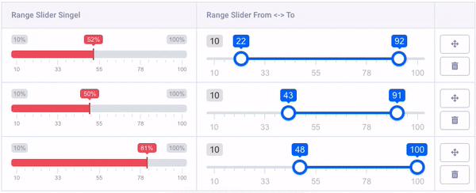

# MX RangeSlider
MX RangeSlider is range fieldtype for ExpressionEngine which helps you to create a really nice and user friendly range select elements.

## Compatibility
* Multi Site Manager
* Channel Form
* Grid

### ExpressionEngine
* ExpressionEngine 3
* ExpressionEngine 4
* ExpressionEngine 5
* ExpressionEngine 6

## Installation
* Download the latest version of MX RangeSlider and extract the .zip to your desktop.
* Copy *mx_rangeslider* to *system/user/addons/third_party/*
* Copy *themes/user/mx_rangeslider* to *themes/user/*

## Activation
* Log into your control panel
* Browse to Addons
* Install MX RangeSlider

## Field settings
**type**	Optional property, will select slider type from two options: single - for single range slider, or double - for double range slider

**min**	Range minumum

**max**	Range maximum

**from**	Optional property, on default has the same value as min.

**to**	Optional property, on default has the same value as max.

**step**	Optional property, set slider step value

**prefix**	Optional property, set prefix text to all values. For example: "$" will convert "100" in to "$100"

**postfix**	Optional property, set postfix text to all values. For example: " €" will convert "100" in to "100 €"

**maxPostfix**	Optional property, set postfix text to maximum value. For example: maxPostfix - "+" will convert "100" to "100+"

**hasGrid**	Optional property, enables grid at the bottom of the slider (it adds 20px height and this can be customised through CSS)

**gridMargin**	Optional property, enables margin between slider corner and grid

**hideMinMax**	Optional property, disables Min and Max fields.

**hideFromTo**	Optional property, disables From an To fields.

**prettify**	Optional property, allow to separate large numbers with spaces, eg. 10 000 than 10000

**values**	Array of custom values: a, b, c etc.

**theme**  Skin.

## Templates Variables

	{field_name}

	{field_name}
		{range_from}
		{range_to}
		{range_value}
	{/field_name}

	{field_name:from}

	{field_name:to}

### Grid Example

**Single Range**

	{grid_field}
		{mx_rangeslider_ft_single}
	{/grid_field}

**Double Range**

	{grid_field}
		{grid_field:mx_rangeslider_ft_double}
			{range_from}
			{range_to}
			{range_value}
		{/grid_field:mx_rangeslider_ft_double}
	{/grid_field}

## Support Policy

This is Communite Edition add-on.

## Contributing To MX RangeSlider

Your participation to MX RangeSlider development is very welcome!

You may participate in the following ways:

* [Report issues](https://github.com/MaxLazar/mx-rangeslider/issues)
* Fix issues, develop features, write/polish documentation
Before you start, please adopt an existing issue (labelled with "ready for adoption") or start a new one to avoid duplicated efforts.
Please submit a merge request after you finish development.

### License

The MX RangeSlider is open-sourced software licensed under the [MIT license](http://opensource.org/licenses/MIT)

### Thanks To
[Denis Ineshin](https://github.com/IonDen) for [ion.rangeSlider](https://github.com/IonDen/ion.rangeSlider) ([MIT license](http://opensource.org/licenses/MIT))
